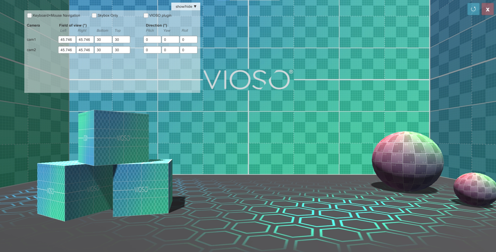

# Multi-frustum Tool
 Test multiple display outputs with frustum inputs or VIOSO API (.vwf) view calculations.
 
 

 # How to use
- [Download the latest build from the releases](https://github.com/vioso/MultiFrustum-Tool/releases)
- Run on the target machine(s). All windows displays will be activated, and a camera is assigned to each.
- **Manual Mode:**
  You can edit the FOV an direction values in the UI.
    - FOV: Angles in degrees: left, right, top, bottom.
    - Direction: Angles in degrees: yaw turns right, positive pitch is up and positive roll turns clockwise.

- **VIOSO mode:**
  Configure the VIOSOWarpBlend.ini file. You can either open it from the UI button or from this path `\MultiFrustum_Data\Plugins\x86_64`
> **Note:** Make sure you restart the scene (Button ⟳) every time you edit the `.ini` file to view the changes.

# Reference
- VIOSO 6 software: https://docs.vioso.com/
- VIOSO Unity plugin: https://docs.vioso.com/integration/real-time-engines/unity3d
- Ini file reference: https://docs.vioso.com/integration/vioso-warpblend-api/viosowarpblend.ini-reference

